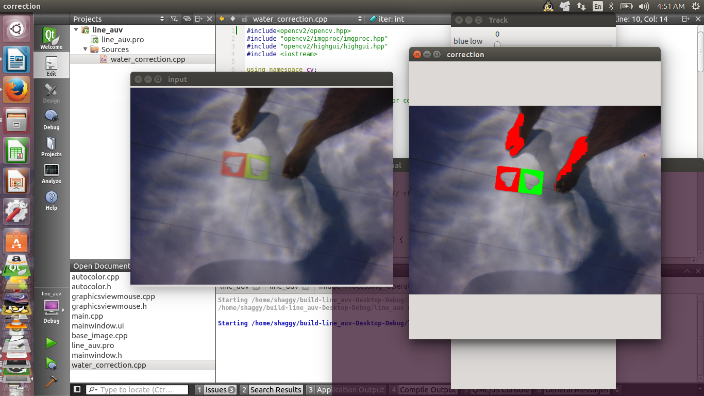
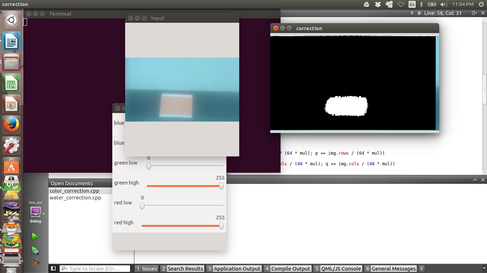

# color-correction
A simple algorithm for underwater image color segmentation for object detection

It is an iterative procedure where we search the pixel for the required color and enhance the RGB color of the image

The screenshot provided at the folder shows my result of the algroithm

Here is another result for getting the mask of the path after thresholding

For more information on the algorithm used you can refere this [paper](https://drive.google.com/file/d/1VkOpqnGE1tqGU0QJa7udORuU3nDu9RnW/view?usp=sharing)

# Algorithms
## Retinex
## RL Deconvolution

Input image    

Output Image    
